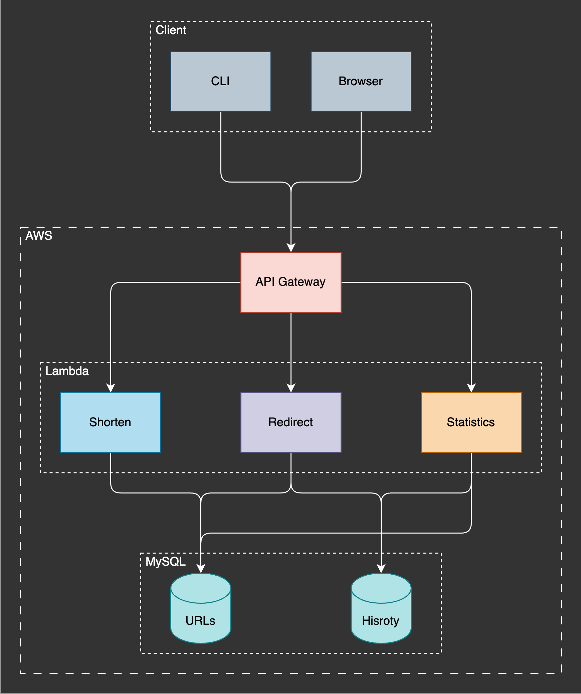

# URL Shortener

Northwestern University CS 310 Final Project by Tzu-Hsuan Huang (thv7996)

A URL shortener project with the following capabilities:

1. Generating a shortened URL.
2. Creating a customized URL.
3. Redirecting a page from a shortened URL to the original URL.
4. Querying statistics on the usage of the shortened URL.

## Client

Clients for this tool include a Python CLI tool and a standard web browser.

#### CLI

- Generate a shortened URL.
  - Input: A long URL
  - Output: A shortened URL
- Generate a URL with a customized path.
  - Input: A long URL and a customized string with a maximum length limit of 16 characters
  - Output: A shortened URL with the specific customized path
- Return the statistics of the usage of the shortened URL.
  - Input: A shortened URL
  - Output: Statistics of the usage of the shortened URL

#### Browser

- Redirect to the original URL, providing the shortened URL.

## Server

The server is hosted on AWS, utilizing Amazon API Gateway and AWS Lambdas, and written in Python.

#### APIs

- Generate a shortened URL.

  - POST: /shorten
  - body:
    ```
    {
      shorturlpath: <string> // null or a string with a maximum size of 16 characters
      longurl: <string> // non-empty string with a maximum size of 156 characters
    }
    ```
  - response:
    ```
    {
      shorturl: <string>
    }
    ```

- Redirect a shortened URL to the original URL.

  - GET: /<shortened-url-path>
  - response: temporary redirect to the original URL

- Get the statistics of the shortened URL.
  - GET: /stats/<shortened-url-path>
  - response:
    ```
    {
      "usage": <int>,
      "hourStats": {
        <string>: <int>
      },
      "cityStats": {
        <string>: <int>
      },
      "ipStats": {
        <string>: <int>
      },
      "regionStats": {
        <string>: <int>
      },
      "countryStats": {
        <string>: <int>
      },
      "browserStats": {
        <string>: <int>
      },
      "osStats": {
        <string>: <int>
      },
      "deviceStats": {
        <string>: <int>
      }
    }
    ```

## Database

A MySQL database with two tables is hosted on Amazon RDS.

#### URLs Table

Stores the mapping from the short URL to the original long URL.

```
(
    urlid        int not null AUTO_INCREMENT,
    shorturl     varchar(16) not null,
    longurl      varchar(256) not null,
    PRIMARY KEY  (urlid),
    UNIQUE       (shorturl)
);
```

#### History Table

Stores the request history of the shortened URL.

```
(
    historyid    int not null AUTO_INCREMENT,
    urlid        int not null,
    created      datetime,
    ip           varchar(16),
    city         varchar(256),
    region       varchar(256),
    country      varchar(256),
    browser      varchar(256),
    os           varchar(256),
    device       varchar(256),
    PRIMARY KEY  (historyid),
    FOREIGN KEY  (urlid) REFERENCES urls(urlid)
);
```

## System Diagram


